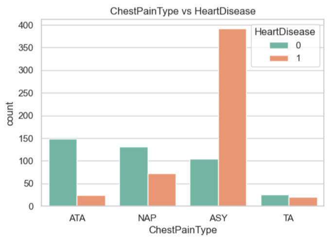
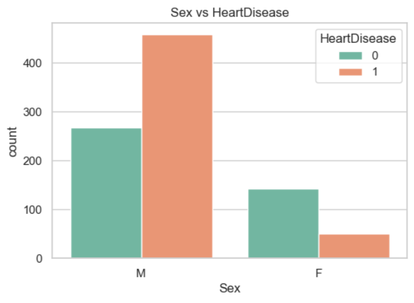
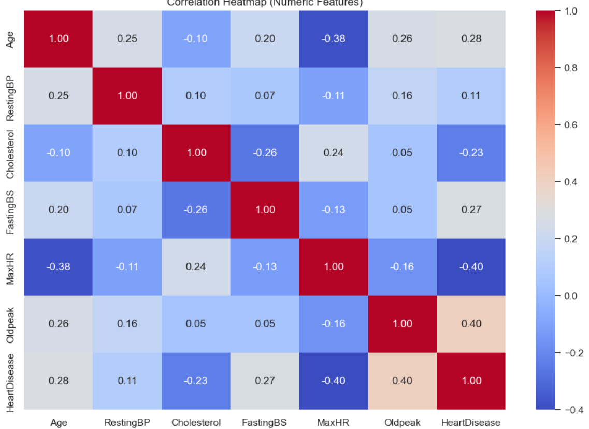
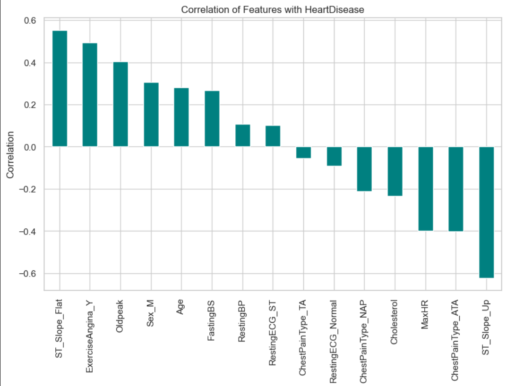

# ❤️ Heart Disease Prediction — End-to-End Data Science Project
---

### Project Overview
Cardiovascular disease remains one of the leading causes of mortality worldwide. Early identification of individuals at high risk enables timely clinical intervention and better patient outcomes.

This project develops and evaluates machine learning models to predict the presence of heart disease using demographic and clinical data. It demonstrates a complete, production-style data science workflow, from raw data to interpretable insights and decision support.

---
### Problem Statement
Given patient demographic and clinical measurements, can we accurately predict whether a patient is at risk of heart disease?

## Why This Matters
Accurate heart disease risk prediction supports:
1. Early screening and preventive care
2. Clinical decision support for physicians
3. Data-driven prioritization of high-risk patients
4. Improved healthcare outcomes with limited resources
This project mirrors real-world healthcare analytics problems where **model performance, interpretability, and clinical relevance** are equally important.

---

## Dataset
- **Source**: Kaggle – Heart Failure Prediction Dataset
- **Format**: CSV (heart.csv)
- **Target** Variable: HeartDisease (Binary classification)

## Key Features
- **Demographic**: Age, Sex
- **Clinical**: Chest Pain Type, RestingBP, Cholesterol, FastingBS, RestingECG
- **Exercise-Related**: MaxHR, ExerciseAngina, Oldpeak, ST_Slope

---
## Analytical Approach**
**1.Data Loading & Cleaning**
 - Handled missing and inconsistent values
 - Encoded categorical variables
 - Scaled numerical features where appropriate

**2.Exploratory Data Analysis (EDA)**
 - Distribution analysis
 - Correlation analysis
 - Feature-target relationships
 - Identification of clinically relevant predictors

**3.Feature Engineering**
 - Transformation of categorical and ordinal features
 - Preparation of model-ready datasets

**4.Model Development**
 - Logistic Regression (baseline, interpretable model)
 - Random Forest Classifier (non-linear, ensemble model)

**5.Model Evaluation**
 - Accuracy
 - ROC-AUC
 - Feature importance analysis

---
## Results & Insights

**Model	                         Accuracy	          ROC-AUC**
Logistic Regression	            ~89%	               —
Random Forest	                  ~88%	              0.93

---
## Key Predictive Features
- ST_Slope
- Max Heart Rate (MaxHR)
- Cholesterol
- Oldpeak
- Exercise-Induced Angina
These features align strongly with known clinical risk factors, reinforcing both the validity and interpretability of the models.

---
## Interactive Analytics Dashboard
To complement the notebook analysis, an interactive dashboard was built to explore:
- Feature distributions
- Model performance
- Feature importance
- Predictive insights

---
## 📊 Exploratory Data Analysis & Visual Insights

The following visualizations were generated using Python to explore relationships between clinical features and heart disease occurrence. These insights informed feature selection, model building, and interpretation.

---

### Chest Pain Type vs Heart Disease

Certain chest pain types—particularly asymptomatic and atypical angina—show a significantly higher association with heart disease, making this a strong predictive feature.

---
### Sex vs Heart Disease

Male patients exhibit a higher prevalence of heart disease in the dataset, highlighting gender-based risk differences.

---
### Correlation Heatmap

This heatmap shows relationships between numerical features. Strong correlations are observed between heart disease and variables such as **ST_Slope**, **MaxHR**, **Oldpeak**, and **ExerciseAngina**.

---
### Feature Correlation with Heart Disease

ST_Slope, ExerciseAngina, and Oldpeak emerge as the most influential predictors, providing strong interpretability and alignment with clinical understanding.

---
## 🧠 Key Takeaways
- Chest pain type is one of the strongest indicators of heart disease  
- Exercise-induced angina and ST-segment slope are critical risk markers  
- Feature correlations align with established medical research, improving model trust and explainability  

---
## Tools & Technologies
- Python: Pandas, NumPy, Scikit-Learn, Matplotlib, Seaborn
- Machine Learning: Logistic Regression, Random Forest
- Analytics & Visualization: Zoho Analytics
- Environment: Jupyter Notebook

---
## How to Run Locally
- Download the dataset (heart.csv)
- Place it in the project directory
- Open and run the Jupyter Notebook sequentially
- Review outputs and model evaluation results

---
## Limitations & Next Steps
- Incorporate cross-validation and hyperparameter tuning
- Evaluate additional models (e.g., Gradient Boosting, XGBoost)
- Address potential class imbalance
- Extend analysis to time-series or longitudinal patient data
- Deploy as an API or clinical decision support tool

---
## Key Takeaway
This project demonstrates the ability to:
- Translate a real healthcare problem into a data science solution
- Build and evaluate predictive models responsibly
- Deliver interpretable insights for non-technical stakeholders
- Combine data science rigor with analytical storytelling
